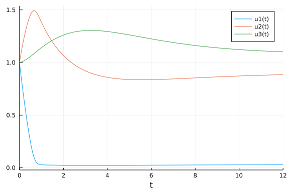

# Weave test

```julia
using Weave
# filename = "01-test.jmd"
# weave(filename; doctype = "md2html", out_path = :pwd)
# weave(filename; doctype = "md2pdf", out_path = :pwd)
using Plots
using DifferentialEquations
```


Now define a differential equation, solve it and make a plot.

```julia
function droop!(du, u, p, t)
    R, Q, X = u
    Km, Vmax, Qmin, muMax, d, R0 = p
    rho = Vmax * R / (Km + R)
    mu = muMax * (1 - Qmin/Q)
    du[1] = dRdt = d*(R0 - R) - rho*X
    du[2] = dQdt = rho - mu*Q
    du[3] = dXdt = (mu - d)*X
  end;
```


Solve the problem.

```julia
problem = ODEProblem(droop!, [1.0, 1.0, 1.0], (0.0, 12.0), [0.1, 2.0, 0.4, 0.9, 0.5, 1.0])
solution = solve(problem, Tsit5());
```


Plot the solution

```julia
Plots.plot(solution)
```


