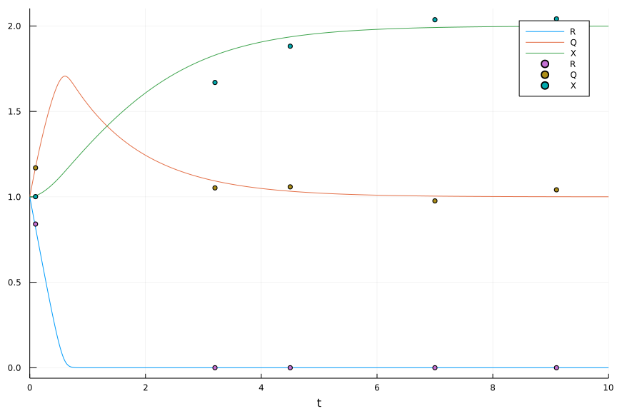

# Parameter estimation from simulated data

## Packages

```julia
using DifferentialEquations, Plots
using Flux, DiffEqFlux, Optim, DiffEqSensitivity
import Statistics
using Turing, Distributions, DifferentialEquations 
using MCMCChains, StatsPlots
using Random
using Logging
```


## Simulating data

I start with the Droop model. 


```julia
function droop!(du, u, p, t)
  R, Q, X = u
  Km, Vmax, Qmin, muMax, d, R0 = p
  rho = Vmax * R / (Km + R)
  mu = muMax * (1 - Qmin/Q)
  du[1] = dRdt = d*(R0 - R) - rho*X
  du[2] = dQdt = rho - mu*Q
  du[3] = dXdt = (mu - d)*X
end
```


The initial conditions, parameters, and time-span for the solution must be specified.
This time we specify some times to sample the solution to obtain data to use in parameter estimation.

```julia
u0 = [1.0, 1.0, 1.0]
p = [0.1, 2.0, 1.0, 0.8, 0.0, 0.0]
tspan = (0.0, 10.0)
tsteps = [0.1, 3.2, 4.5, 7.0, 9.1]
```


Now we create and solve the ODE initial value problem. We will create two solutions,
one smoothly estimating the solution with interpolation on an interval and one with 
samples at a few discrete points.


```julia
prob = ODEProblem(droop!, u0, tspan, p)
sol1 = solve(prob, Tsit5())
sol2 = solve(prob, Rosenbrock23(), saveat = tsteps)
```


This plot shows the solution and the discrete samples.


We can convert the solution to a matrix and add some noise to the output. These data will be used to define the objective function in the optimization.

```julia
data1 = Array(sol2) 
data1 = data1 .* (1 .+ 0.05*randn(size(data1)));
Plots.plot(sol1, label = ['R' 'Q' 'X'])
Plots.scatter!(sol2.t, data1', label = ['R' 'Q' 'X'])
```




## Optimization to find parameters

Now write a function to describe the difference between a trial solution and the
data points.  For the optimizer we use next, this should be a function of just the 
parameters to be adjusted.
Here my loss function is the sum of squared difference between solution and data. I experimented with scaling by standard deviation 
of each variable in data, but ran into trouble with R which is usually 0.

```julia
function loss(p)
    tspan = (0.0, 10.0)
    u0 = p[1:3]
    param = [ p[4:7] ; 0.0 ; 0.0 ] # force d = Rin = 0.0
    prob = ODEProblem(droop!, u0, tspan, param)
    sol2 = solve(prob, Rosenbrock23(), saveat = tsteps)
    data2 = Array(sol2)
    # loss = sum(((1.0 ./ Statistics.std(data1, dims=2)') * (data2 .- data1) ) .^ 2 )
    # loss = sum(((1.0 ./ (1 .+ Statistics.std(data1, dims=2)')) * (data2 .- data1) ) .^ 2 )
    loss = sum( (data2 .- data1) .^ 2 )
  return loss , sol2
end
```


(Note: I originally standardized the three variables as in the commented loss definition above, but 
this resulted in a worse solution, because R was so close to 0 and has a standard deviation of 10^{-7}. Perhaps a solution is to add a small amount to standard deviations to prevent this distortion. My first 
attempt, also commented out, did led to instabilities.)

The optimizer allows us to provide a callback function to show the loss score, or make a plot, at each iteration.  Here's an example callback function.
The callback has access to all the return values of the loss function.

```julia
callback = function (p, l, pred)
  display(l)
  # plt = plot(pred, ylim = (0, 6))
  # display(plt)
  # Tell sciml_train to not halt the optimization. If return true, then
  # optimization stops.
  return false
end
```


Test the loss function before proceeding.

```julia
loss([1.0; 1.0; 1.0; p])
```

```
(0.0381854685009557, t: [0.1, 3.2, 4.5, 7.0, 9.1]
u: [[0.8194448617123582, 1.1731174127897068, 1.0063561287792864], [-4.3247441352406944e-13, 1.092662631142999, 1.8307612862597094], [-5.1339331824071045e-15, 1.0323880304289377, 1.9376392208132505], [4.375444133471578e-18, 1.00420411122562, 1.992008464727631], [-2.660209756869388e-19, 1.0006732783836856, 1.9990287483735543]])
```


We are now ready to use the optimizer. ADAM is the gradient-search method. The optimizer is defined in DiffEqFlux (https://diffeqflux.sciml.ai/v1.34/Scimltrain/) but can use many different backends.
The optimizer is ADAM: https://arxiv.org/abs/1412.6980


```julia
result_ode = DiffEqFlux.sciml_train(loss, [1.0, 1.0, 1.0, 0.1, 2.0, 1.0, 1.0, 0, 0],
                                    ADAM(0.001),  # this argument needs to be small or instability
                                    cb = callback,
                                    maxiters = 200)
```


Now we use the parameters from this optimization to solve the differential equation
and plot the solution.

```julia
prob = ODEProblem(droop!, result_ode.u[1:3], tspan, result_ode.u[4:end])
sol3 = solve(prob, Rosenbrock23())
```


We will plot the solution and the discrete samples.


Compare parameters.


## Bayesian MCMC parameter estimation

Set a random seed to make the result reproducible. Select an option for Turing package.

```julia
Random.seed!(14)
Turing.setadbackend(:forwarddiff)
```


Define a model for the parameters, including priors, solution of the ODE, and comparison between data and the solution.

```julia
@model function fitDroop1(t, R, Q, X)
    σ1 ~ InverseGamma(2, 3)  # positive support; parameters α, β; mean β/(α-1), here 3
    σ2 ~ InverseGamma(2, 3) 
    σ3 ~ InverseGamma(2, 3) 
    R0 ~ truncated(Normal(1, 1), 0, 5) # might need strictly positive values?
    Q0 ~ truncated(Normal(1, 1), 0, 5)
    X0 ~ truncated(Normal(1, 1), 0, 5)
    Km ~ truncated(Normal(4.0, 2), 0, 5)
    Vmax ~ truncated(Normal(1.2, 2), 0, 5)
    Qmin ~ truncated(Normal(1.0, 2), 0, 5)
    muMax ~ truncated(Normal(1.0, 2), 0, 5)

    p = [ Km, Vmax, Qmin, muMax, 0.0, 0.0]

    # must define the problem with numeric values first, then update with distributions
    prob1 = ODEProblem(droop!, [R[1], Q[1], X[1]], (0.0, 10.0), [0.1, 1.0, 1.0, 1.0, 0.0, 0.0])
    prob = remake(prob1, u0=[R0, Q0, X0], p=p)  
    predicted = solve(prob, Rosenbrock23(), saveat=t)
    
    for j = 1:length(t)
        Q[j] ~ Normal(predicted[j][2], σ1)
        X[j] ~ Normal(predicted[j][3], σ2)
    end
    R[1] ~ Normal(predicted[1][1], σ3)   # Just use the first (non-zero) DIN to anchor the solution
end
```


Create the model and simulate the chains.

```julia
t = sol2.t
R = [v[1] for v in sol2.u]
Q = [v[2] for v in sol2.u]
X = [v[3] for v in sol2.u]

model = fitDroop1(t, R, Q, X)
chain2 = sample(model, NUTS(.65), MCMCThreads(), 2000, 4, progress=false)  # multi-threaded
# chain2 = mapreduce(c -> sample(model, NUTS(.75), 200), chainscat, 1:4) # single thread
```


Show the results.

```julia
chain2
```

```
Chains MCMC chain (2000×22×4 Array{Float64, 3}):

Iterations        = 1:2000
Thinning interval = 1
Chains            = 1, 2, 3, 4
Samples per chain = 2000
parameters        = Km, Q0, Qmin, R0, Vmax, X0, muMax, σ1, σ2, σ3
internals         = acceptance_rate, hamiltonian_energy, hamiltonian_energy_error, is_accept, log_density, lp, max_hamiltonian_energy_error, n_steps, nom_step_size, numerical_error, step_size, tree_depth

Summary Statistics
  parameters      mean       std   naive_se      mcse         ess      rhat
      Symbol   Float64   Float64    Float64   Float64     Float64   Float64

          Km    3.0740    1.2398     0.0139    0.0188   4241.7433    1.0011
          Q0    1.1294    0.4890     0.0055    0.0103   2294.2089    1.0018
        Qmin    1.0728    0.2977     0.0033    0.0068   2241.0310    1.0013
          R0    1.0285    0.5198     0.0058    0.0092   3318.2485    1.0011
        Vmax    2.1439    1.2314     0.0138    0.0225   3733.0669    1.0005
          X0    1.1490    0.4683     0.0052    0.0083   3226.7704    1.0004
       muMax    2.0747    1.2255     0.0137    0.0218   3719.2203    1.0006
          σ1    0.6171    0.2852     0.0032    0.0059   2641.9690    1.0004
          σ2    0.6700    0.3196     0.0036    0.0065   2457.2150    1.0011
          σ3    1.6390    1.5524     0.0174    0.0343   2104.5439    1.0008

Quantiles
  parameters      2.5%     25.0%     50.0%     75.0%     97.5%
      Symbol   Float64   Float64   Float64   Float64   Float64

          Km    0.4475    2.1801    3.2308    4.0941    4.8986
          Q0    0.2552    0.7917    1.1079    1.4207    2.2333
        Qmin    0.5386    0.8956    1.0538    1.2306    1.6694
          R0    0.1328    0.6454    0.9992    1.3713    2.1118
        Vmax    0.1409    1.1555    2.0704    3.0579    4.5870
          X0    0.3559    0.8297    1.1020    1.4240    2.2271
       muMax    0.1388    1.0844    1.9462    2.9606    4.5952
          σ1    0.2763    0.4291    0.5568    0.7243    1.3293
          σ2    0.2901    0.4551    0.5959    0.7976    1.5012
          σ3    0.4532    0.8236    1.2177    1.8631    5.6117
```


Extract data so we can plot trajectories from a selection of parameter values from the posterior distribution. Parameters come out of the chains in alphabetical order, so I resequence them to be in the order: initial conditons, parameter values as used in ODE function.

```julia
chain_array0 = Array(chain2);
chain_array = chain_array0[: ,[4, 2, 6, 1, 5, 3, 7] ]  # R Q X Km Vmax Qmin muMax
```


It looks like having only a few data points leaves a lot of uncertainty about the trajectory!

