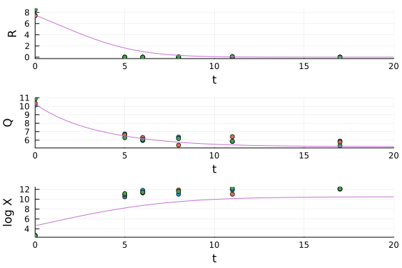
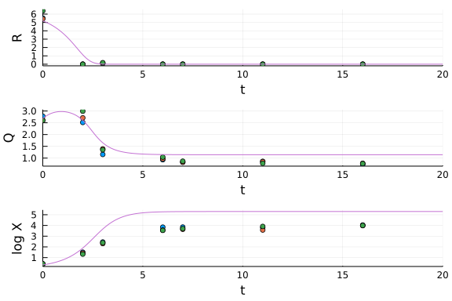
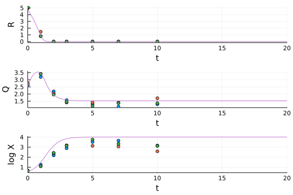
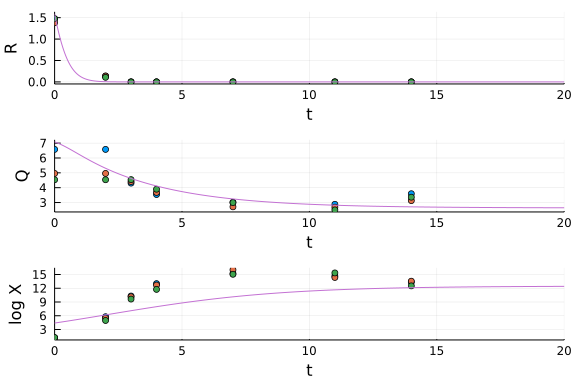

# Point estimates

Of parameters an initial conditions for the Droop-Grover system using data from Liefer et al (2019).

```julia
using DataFrames, CSV, StatsPlots, Query
using DifferentialEquations, Plots
using Flux, DiffEqFlux, Optim, DiffEqSensitivity
import Statistics
using LinearAlgebra
using PrettyTables  # add PrettyTables@0.12.0 # not 0.11 # downgrades other packages... incompatible

# read data
cd("/Users/airwin/Dropbox/Julia/ode-parameter-estimation/")
liefer = CSV.File("liefer-growth-data.csv") |> DataFrame ;
rename!(liefer, [2 => :days, 5 => :cell_density, 7 => :dilution_factor])
replace!(liefer.dilution_factor, missing => 1.0)
replace!(liefer.DIN, missing => 0.0)
transform!(liefer, :DIN => (x -> x .* (10^3 * 14)) => :DIN_pgml)
gdf = groupby(liefer, [:Species, :Replicate])
transform!(gdf, :dilution_factor => cumprod)
transform!(gdf, :dilution_factor_cumprod => ( (x) -> x ./ minimum(x)) => :dilution_factor_min)
transform!(gdf, [:cell_density, :dilution_factor_min] => ( ./ ) => :cells)
transform!(liefer, [:days, :DIN_pgml] => ByRow((x,y) -> x === 0 ? missing : y) => :DIN_pgml_corr)
transform!(liefer, [:DIN_pgml_corr, :N, :cells] => ( (R,Q,X) -> R .+ Q .* X ) => :mass)

Tp = filter([:Species, :cells ] => (x,y) -> x == "Thalassiosira pseudonana" && !ismissing(y), liefer)[:, [:days, :Replicate, :DIN_pgml, :N, :cells, :mass]]
Tw = filter([:Species, :cells ] => (x,y) -> x == "Thalassiosira weissflogii" && !ismissing(y), liefer)[:, [:days, :Replicate, :DIN_pgml, :N, :cells, :mass]]
Ot = filter([:Species, :cells ] => (x,y) -> x == "Ostreococcus tauri" && !ismissing(y), liefer)[:, [:days, :Replicate, :DIN_pgml, :N, :cells, :mass]]
Ms = filter([:Species, :cells ] => (x,y) -> x == "Micromonas sp." && !ismissing(y), liefer)[:, [:days, :Replicate, :DIN_pgml, :N, :cells, :mass]]

# define ODE
function droop!(du, u, p, t)
  R, Q, X = u
  Km, Vmax, Qmin, muMax, d, R0 = p
  rho = Vmax * R / (Km + R)
  mu = muMax * (1 - Qmin/Q)
  du[1] = dRdt = d*(R0 - R) - rho*X
  du[2] = dQdt = rho - mu*Q
  du[3] = dXdt = (mu - d)*X
end
```


Define a loss function that uses all three replicates from a single species, allows for distinct initial conditions for each replicate, but estimates a common parameter set for all three.

```julia
# DF = Ms # data for this calculation
# my_error(dataM, solutionM) -> sum((dataM .- solutionM) .^ 2) # simple version; does not work well.
function my_error(dataM, solutionM)
   # Define distance between data and solution at same time points.
   # Input is matrix with 3 rows (R, Q, X) and an arbitrary number of columns (time points)
   # Transform X to a log scale
   # down-weight / ignore R when very close to 0 (small nutrients not well measured)
   rDelta = map((x,y) -> x > 0.01 ? (x-y) : 0, dataM[1,:], solutionM[1,:])
   qDelta = dataM[2,:] .- solutionM[2, :]
   xDelta = log.(dataM[3,:] ./ solutionM[3,:])
   sum(abs2, rDelta) + sum(abs2, qDelta) + sum(abs2, xDelta)
end

function loss(p)
    tspan = (0.0, 20.0)
    p = identity.(p) # get rid of missing values / types; causes problems with ODE solver.
    u0a = p[1:3]
    if length(p) == 7
      param = [ p[(1:4) .+ 3] ; 0.0 ; 0.0 ] # force d = Rin = 0.0
    else     
      u0b = p[(1:3) .+ 3]
      u0c = p[(1:3) .+ 6]
      param = [ p[(1:4) .+ 9] ; 0.0 ; 0.0 ] # force d = Rin = 0.0
    end
    prob = ODEProblem(droop!, u0a, tspan, param)

    # data0a = identity.(Array(filter(:Replicate => x -> x == "A", DF)[:, [:days, :DIN_pgml, :N, :cell_density]])')
    # data0b = identity.(Array(filter(:Replicate => x -> x == "B", DF)[:, [:days, :DIN_pgml, :N, :cell_density]])')
    # data0c = identity.(Array(filter(:Replicate => x -> x == "C", DF)[:, [:days, :DIN_pgml, :N, :cell_density]])')
    tsteps = data0a[1,:]
    data1a = data0a[2:end,:]
    # prob = ODEProblem(droop!, u0a, param)
    # sol2a = solve(prob, saveat = tsteps)
    # sol2a = solve(prob, Rosenbrock23(), saveat = tsteps)
    sol2a = solve(remake(prob, u0 = u0a, p = param), Rosenbrock23(), saveat = tsteps)
    data2a = Array(sol2a)

    if length(p) > 7
      tsteps = data0b[1,:]
      data1b = data0b[2:end,:]
      sol2b = solve(remake(prob, u0 = u0b, p = param), Rosenbrock23(), saveat = tsteps)
      data2b = Array(sol2b)

      tsteps = data0c[1,:]
      data1c = data0c[2:end,:]
      sol2c = solve(remake(prob, u0 = u0c, p = param), Rosenbrock23(), saveat = tsteps)
      data2c = Array(sol2c)

      # loss = sum(((1.0 ./ Statistics.std(data1, dims=2)') * (data2 .- data1) ) .^ 2 )
      # loss = sum(((1.0 ./ (1 .+ Statistics.std(data1, dims=2)')) * (data2 .- data1) ) .^ 2 )
      # loss = sum( (data2a .- data1a) .^ 2 ) + sum( (data2b .- data1b) .^ 2 ) + sum( (data2c .- data1c) .^ 2 )
      loss = my_error(data1a, data2a) + my_error(data1b, data2b) + my_error(data1c, data2c)
    else
      loss = my_error(data1a, data2a)
    end

  return loss, sol2a # , sol2b, sol2c
end
```


Test the loss function.

```julia
DF = Ms
my_scale = Diagonal([1.0, 1/100000.0,  100.0,  1/1000000.0])
# the following can't be defined in loss() or causes error in sciml_train function call
data0a = my_scale * identity.(Array(filter(:Replicate => x -> x == "A", DF)[:, [:days, :DIN_pgml, :N, :cells]])')
data0b = my_scale * identity.(Array(filter(:Replicate => x -> x == "B", DF)[:, [:days, :DIN_pgml, :N, :cells]])')
data0c = my_scale * identity.(Array(filter(:Replicate => x -> x == "C", DF)[:, [:days, :DIN_pgml, :N, :cells]])')

# p = [1.0, 1.0, 1.0,  1.0, 1.0, 1.0,  1.0, 1.0, 1.0,  100000.0, 200.0, 0.5, 1.0]  # 3 sets of 3 initial conditions, 4 parameters (Km, Vmax, Qmin, µmax)
# p = [ vec(Array(DF[1:3, 3:5])') ; 100000.0 ; 0.1; 0.5; 1.0]
p = [ data0a[2:end, 1]; data0b[2:end, 1]; data0c[2:end, 1]; 10.0; 0.1; 0.5; 1.0]
p = identity.(p) # get rid of missing value types; causes problems with ODE solver and sciml_train
loss(p)
```


Perform the optimization.  Convergence is very slow, as you might expect, with the full set of 3 x 3 initial conditions and 4 parameters. Search for parameters first using only one initial condition, then include the others.

```julia
# p1 = identity.([ vec(Array(DF[1, 3:5])') ; 100000.0 ; 0.1; 0.5; 1.0] )
p1 = identity.([ data0a[2:end, 1]; 10.0 ; 0.1; 0.5; 1.0] )
result_Ms = DiffEqFlux.sciml_train(loss, p1,
                                    ADAM(0.1),  # this argument needs to be small or instability
                                    # cb = callback,
                                    maxiters = 200)
# p3 = identity.([ vec(Array(DF[1:3, 3:5])') ; 100000.0 ; 0.1; 0.5; 1.0] )
p3 = [ data0a[2:end, 1]; data0b[2:end, 1]; data0c[2:end, 1]; 10.0; 0.1; 0.5; 1.0]
p3[1:3] = result_Ms.u[1:3]
p3[10:end] = result_Ms.u[4:end]
result_Ms2 = DiffEqFlux.sciml_train(loss, p3,
                                    ADAM(0.01),  # this argument needs to be small or instability
                                    # cb = callback,
                                    maxiters = 200)
```


## Results for Micromonas sp.

Show parameters.

```julia
dt = result_Ms2.u[10:13]
pretty_table(dt', ["Km", "Vmax", "Qmin", "µmax"])
```


Show initial conditions and estimated initial conditions (scaled).

```julia
dt = [data0a[2:end,1] result_Ms2.u[1:3] data0b[2:end,1] result_Ms2.u[(1:3) .+ 3] data0c[2:end,1] result_Ms2.u[(1:3) .+ 6]]
# header = (["R", "", "Q", "", "X", ""], ["Data", "Model", "Data", "Model", "Data", "Model"])
# pretty_table(dt, row_names = ["Rep 1", "Rep 2" ,"Rep 3"]; header = header)
header = ["Rep1 data", "Rep1 model", "Rep2 data", "Rep2 model", "Rep3 data", "Rep3 model"]
pretty_table(dt, header, row_names = ["R", "Q" ,"ln X"])
```


Show solution and data (scaled).

```julia
soln = solve(ODEProblem(droop!, result_Ms2.u[1:3], (0.0, 20.0), [result_Ms2.u[10:13]; 0.0; 0.0]), Rosenbrock23())
Plots.scatter(data0a[1,:], data0a[2:end,:]', layout = (3,1), ylabel = ["R" "Q" "log X"])
Plots.scatter!(data0b[1,:], data0b[2:end,:]')
Plots.scatter!(data0c[1,:], data0c[2:end,:]')
Plots.plot!(soln, legend=false)
```




## T weisflogii


```julia
DF = Tw
my_scale = Diagonal([1.0, 1/100000.0,  0.1,  1/10000.0])
data0a = my_scale * identity.(Array(filter(:Replicate => x -> x == "A", DF)[:, [:days, :DIN_pgml, :N, :cells]])')
data0b = my_scale * identity.(Array(filter(:Replicate => x -> x == "B", DF)[:, [:days, :DIN_pgml, :N, :cells]])')
data0c = my_scale * identity.(Array(filter(:Replicate => x -> x == "C", DF)[:, [:days, :DIN_pgml, :N, :cells]])')

p = [ data0a[2:end, 1]; data0b[2:end, 1]; data0c[2:end, 1]; 10.0; 0.1; 0.5; 1.0]
p = identity.(p) # get rid of missing value types; causes problems with ODE solver and sciml_train

p1 = identity.([ data0a[2:end, 1]; 10.0 ; 0.1; 0.5; 1.0] )
result_Tw = DiffEqFlux.sciml_train(loss, p1,
                                    ADAM(0.1),  # this argument needs to be small or instability
                                    # cb = callback,
                                    maxiters = 200)
p3 = [ data0a[2:end, 1]; data0b[2:end, 1]; data0c[2:end, 1]; 10.0; 0.1; 0.5; 1.0]
p3[1:3] = result_Tw.u[1:3]
p3[10:end] = result_Tw.u[4:end]
result_Tw2 = DiffEqFlux.sciml_train(loss, p3,
                                    ADAM(0.01),  # this argument needs to be small or instability
                                    # cb = callback,
                                    maxiters = 500)

dt = result_Tw2.u[10:13]
pretty_table(dt', ["Km", "Vmax", "Qmin", "µmax"])
dt = [data0a[2:end,1] result_Tw2.u[1:3] data0b[2:end,1] result_Tw2.u[(1:3) .+ 3] data0c[2:end,1] result_Tw2.u[(1:3) .+ 6]]
header = ["Rep1 data", "Rep1 model", "Rep2 data", "Rep2 model", "Rep3 data", "Rep3 model"]
pretty_table(dt, header, row_names = ["R", "Q" ,"ln X"])
soln = solve(ODEProblem(droop!, result_Tw2.u[1:3], (0.0, 20.0), [result_Tw2.u[10:13]; 0.0; 0.0]), Rosenbrock23())
Plots.scatter(data0a[1,:], data0a[2:end,:]', layout = (3,1), ylabel = ["R" "Q" "log X"])
Plots.scatter!(data0b[1,:], data0b[2:end,:]')
Plots.scatter!(data0c[1,:], data0c[2:end,:]')
Plots.plot!(soln, legend=false)
```




## T pseudonana


```julia
DF = Tp
my_scale = Diagonal([1.0, 1/100000.0,  1.0,  1/100000.0])
data0a = my_scale * identity.(Array(filter(:Replicate => x -> x == "A", DF)[:, [:days, :DIN_pgml, :N, :cells]])')
data0b = my_scale * identity.(Array(filter(:Replicate => x -> x == "B", DF)[:, [:days, :DIN_pgml, :N, :cells]])')
data0c = my_scale * identity.(Array(filter(:Replicate => x -> x == "C", DF)[:, [:days, :DIN_pgml, :N, :cells]])')

p = [ data0a[2:end, 1]; data0b[2:end, 1]; data0c[2:end, 1]; 10.0; 0.1; 0.5; 1.0]
p = identity.(p) # get rid of missing value types; causes problems with ODE solver and sciml_train

p1 = identity.([ data0a[2:end, 1]; 10.0 ; 0.1; 0.5; 1.0] )
result_Tp = DiffEqFlux.sciml_train(loss, p1,
                                    ADAM(0.1),  # this argument needs to be small or instability
                                    # cb = callback,
                                    maxiters = 200)
p3 = [ data0a[2:end, 1]; data0b[2:end, 1]; data0c[2:end, 1]; 10.0; 0.1; 0.5; 1.0]
p3[1:3] = result_Tp.u[1:3]
p3[10:end] = result_Tp.u[4:end]
result_Tp2 = DiffEqFlux.sciml_train(loss, p3,
                                    ADAM(0.01),  # this argument needs to be small or instability
                                    # cb = callback,
                                    maxiters = 500)

dt = result_Tp2.u[10:13]
pretty_table(dt', ["Km", "Vmax", "Qmin", "µmax"])
dt = [data0a[2:end,1] result_Tp2.u[1:3] data0b[2:end,1] result_Tp2.u[(1:3) .+ 3] data0c[2:end,1] result_Tp2.u[(1:3) .+ 6]]
header = ["Rep1 data", "Rep1 model", "Rep2 data", "Rep2 model", "Rep3 data", "Rep3 model"]
pretty_table(dt, header, row_names = ["R", "Q" ,"ln X"])
soln = solve(ODEProblem(droop!, result_Tp2.u[1:3], (0.0, 20.0), [result_Tp2.u[10:13]; 0.0; 0.0]), Rosenbrock23())
Plots.scatter(data0a[1,:], data0a[2:end,:]', layout = (3,1), ylabel = ["R" "Q" "log X"])
Plots.scatter!(data0b[1,:], data0b[2:end,:]')
Plots.scatter!(data0c[1,:], data0c[2:end,:]')
Plots.plot!(soln, legend=false)
```




## O tauri


```julia
DF = Ot
my_scale = Diagonal([1.0, 1/1000000.0,  100.0,  1/1000000.0])
data0a = my_scale * identity.(Array(filter(:Replicate => x -> x == "A", DF)[:, [:days, :DIN_pgml, :N, :cells]])')
data0b = my_scale * identity.(Array(filter(:Replicate => x -> x == "B", DF)[:, [:days, :DIN_pgml, :N, :cells]])')
data0c = my_scale * identity.(Array(filter(:Replicate => x -> x == "C", DF)[:, [:days, :DIN_pgml, :N, :cells]])')

p = [ data0a[2:end, 1]; data0b[2:end, 1]; data0c[2:end, 1]; 10.0; 0.1; 0.5; 1.0]
p = identity.(p) # get rid of missing value types; causes problems with ODE solver and sciml_train

p1 = identity.([ data0a[2:end, 1]; 10.0 ; 0.1; 0.5; 1.0] )
result_Ot = DiffEqFlux.sciml_train(loss, p1,
                                    ADAM(0.1),  # this argument needs to be small or instability
                                    # cb = callback,
                                    maxiters = 200)
p3 = [ data0a[2:end, 1]; data0b[2:end, 1]; data0c[2:end, 1]; 10.0; 0.1; 0.5; 1.0]
p3[1:3] = result_Ot.u[1:3]
p3[10:end] = result_Ot.u[4:end]
result_Ot2 = DiffEqFlux.sciml_train(loss, p3,
                                    ADAM(0.01),  # this argument needs to be small or instability
                                    # cb = callback,
                                    maxiters = 500)

dt = result_Ot2.u[10:13]
pretty_table(dt', ["Km", "Vmax", "Qmin", "µmax"])
dt = [data0a[2:end,1] result_Ot2.u[1:3] data0b[2:end,1] result_Ot2.u[(1:3) .+ 3] data0c[2:end,1] result_Ot2.u[(1:3) .+ 6]]
header = ["Rep1 data", "Rep1 model", "Rep2 data", "Rep2 model", "Rep3 data", "Rep3 model"]
pretty_table(dt, header, row_names = ["R", "Q" ,"ln X"])
soln = solve(ODEProblem(droop!, result_Ot2.u[1:3], (0.0, 20.0), [result_Ot2.u[10:13]; 0.0; 0.0]), Rosenbrock23())
Plots.scatter(data0a[1,:], data0a[2:end,:]', layout = (3,1), ylabel = ["R" "Q" "log X"])
Plots.scatter!(data0b[1,:], data0b[2:end,:]')
Plots.scatter!(data0c[1,:], data0c[2:end,:]')
Plots.plot!(soln, legend=false)
```




Are the bad fits because of poor convergence, inappropriate scaling, or some other factor?
