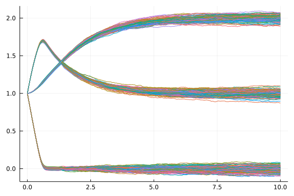

# Probability distributions on numerical solutions

Probabilistic ODE solutions based on Bayesian filtering. Not really sure what this means... but it's not inference, but a different approach to quantifying numerical error.

```julia
using ProbNumDiffEq
using DifferentialEquations, Plots

function droop!(du, u, p, t)
  R, Q, X = u
  Km, Vmax, Qmin, muMax = p
  d = 0.0
  R0 = 0.0
  rho = Vmax * R / (Km + R)
  mu = muMax * (1 - Qmin/Q)
  du[1] = dRdt = d*(R0 - R) - rho*X
  du[2] = dQdt = rho - mu*Q
  du[3] = dXdt = (mu - d)*X
end

# Initial condition
u0 = [1.0, 1.0, 1.0]

# Simulation interval and intermediary points
tspan = (0.0, 10.0)
tsteps = 0.0:0.1:10.0

p = [0.1, 2.0, 1.0, 0.8]

# Setup the ODE problem, then solve
prob = ODEProblem(droop!, u0, tspan, p)
sol = solve(prob, Tsit5())

Plots.plot(sol)

sol2 = solve(prob, EK0(order=1), abstol = 1e-2, reltol = 1e-2)
samples = ProbNumDiffEq.sample(sol2, 100)

p1 = plot(sol2.t, samples[:,:,1])
for i in 2:100 
    p1 = plot!(sol2.t, samples[:,:,i])
end
plot(p1, legend=false)
```


