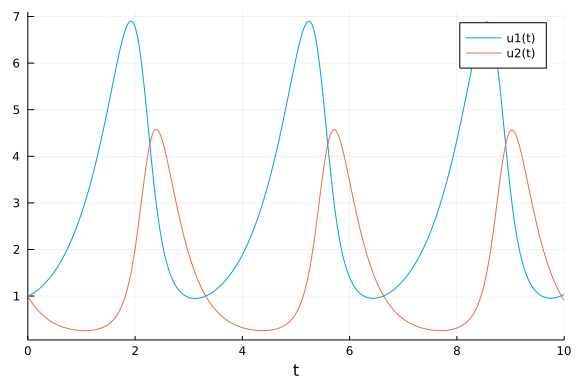
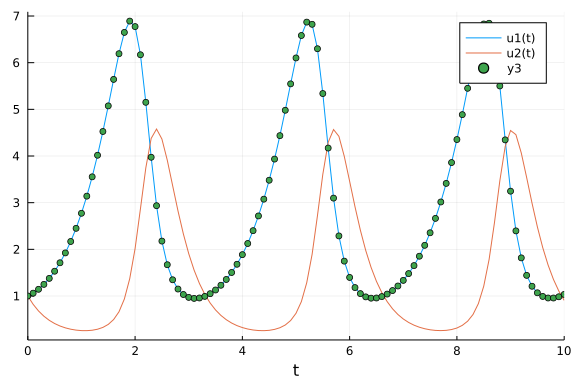

# Neural ODE

Learn the "right hand side" of an ODE system.

And use the neural network approximations.

Make an example. Based on https://julialang.org/blog/2019/01/fluxdiffeq/

Start with a Lotka-Volterra example ODE.

```julia
using DifferentialEquations
function lotka_volterra(du,u,p,t)
  x, y = u
  α, β, δ, γ = p
  du[1] = dx = α*x - β*x*y
  du[2] = dy = -δ*y + γ*x*y
end
u0 = [1.0,1.0]
tspan = (0.0,10.0)
p = [1.5,1.0,3.0,1.0]
prob = ODEProblem(lotka_volterra,u0,tspan,p)
sol = solve(prob)
using Plots
plot(sol)
```




Rewrite the problem so that the initial conditions and time interval is a function of the parameters.

```julia
u0_f(p) = [p[2],p[4]]
tspan_f(p) = (0.0,10*p[4])
p = [1.5,1.0,3.0,1.0]
prob = ODEProblem(lotka_volterra, u0_f(p), tspan_f(p), p)
```

```
ODEProblem with uType Vector{Float64} and tType Float64. In-place: true
timespan: (0.0, 10.0)
u0: 2-element Vector{Float64}:
 1.0
 1.0
```


Get solution at discrete points.

```julia
p = [1.5,1.0,3.0,1.0]
prob = ODEProblem(lotka_volterra,u0,tspan,p)
sol = solve(prob,Tsit5(),saveat=0.1)
A = sol[1,:] # length 101 vector
plot(sol)
t = 0:0.1:10.0
scatter!(t,A)
```




Define a neural network

```julia
using Flux, DiffEqFlux
p = [2.2, 1.0, 2.0, 0.4] # Initial Parameter Vector
params = Flux.params(p)

function predict_rd() # Our 1-layer "neural network"
  solve(prob,Tsit5(),p=p,saveat=0.1)[1,:] # override with new parameters
end

loss_rd() = sum(abs2,x-1 for x in predict_rd()) # loss function
```

```
loss_rd (generic function with 1 method)
```


Train the neural network

```julia
data = Iterators.repeated((), 100)
opt = ADAM(0.1)
cb = function () #callback function to observe training
  display(loss_rd())
  # using `remake` to re-create our `prob` with current parameters `p`
  # display(plot(solve(remake(prob,p=p),Tsit5(),saveat=0.1),ylim=(0,6)))
end

# Display the ODE with the initial parameter values.
cb()

Flux.train!(loss_rd, params, data, opt, cb = cb)
```

```
4311.399889162728
1972.501853678239
1016.6500715801081
566.990652532048
326.1177132125398
177.12296287728526
92.15258043613393
50.700701726164496
30.614443037904838
19.73096142745808
13.627359195513185
10.475125224928691
9.106839680637869
8.663465600631675
8.714710266031283
9.209117202684299
10.117808355855184
11.311428886207334
12.566417707783646
13.740367731985453
14.741857437454295
15.542479618397266
16.14923530212896
16.573530429445896
16.831753508128255
16.937888971418808
16.91753645909311
16.796109318038585
16.59569918511716
16.33653404293024
16.031258513258575
15.689289399646212
15.324602234733495
14.955105071482732
14.567534684866091
14.177085494548065
13.78575290554122
13.396582862349357
13.009279953351925
12.62545607831492
12.24854710105914
11.879083837404643
11.51685455962762
11.161624898333978
10.813116648651107
10.470986498475664
10.13483472330083
9.80421004611882
9.478632293247184
9.157612477210444
8.8406728712617
8.52736668570153
8.217289457981868
7.910087223204818
7.605458127639236
7.303133564226252
7.002810817948736
6.704087049604831
6.416125375717762
6.127334780599611
5.840198217619444
5.561465818742133
5.286468160521922
5.01647184799542
4.752388707882859
4.494872374651992
4.244461111988742
4.001572830202124
3.7664472965003792
3.5397991679416076
3.323102926037852
3.1171066702132415
2.920649140102801
2.7333582923873476
2.55527971746459
2.386239685743074
2.2259942874577843
2.0743244622607735
1.9310437906038111
1.7960145413325284
1.6690666552265894
1.5500784118081785
1.438274772811291
1.332951482566092
1.23361902741244
1.13996923860057
1.0517654426811023
0.9687737539511452
0.8907578252747343
0.8175039396857877
0.7487785769754322
0.6843574434924794
0.6240721976819712
0.5676855929601178
0.5150105481286457
0.46589479332728845
0.4202137310269641
0.3778597590688129
0.3387324465907632
0.3027303672366921
0.26974095972784223
```


