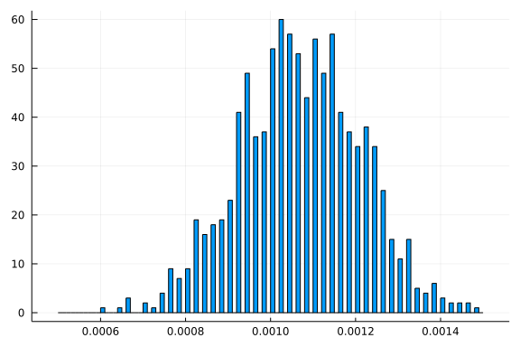
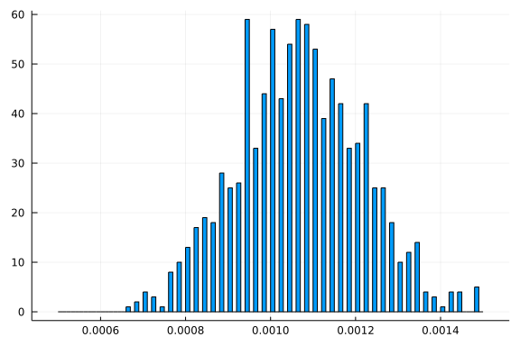

# Multithreads demonstration

From YouTube lecture by Alan Edelman as part of MIT 18.S191 "Computational Thinking" Week 8 on Julia youtube channel.

https://www.youtube.com/watch?v=dczkYlOM2sg

Start by creating multithread kernel option for jupyter lab, or start with julia --numthreads 10

e.g. installkernel("Julia (4 threads)", env=Dict("JULIA_NUM_THREADS" => "4")

```julia
julia> Threads.nthreads()
8

julia> using StaticArrays, Plots, StatsBase, FLoops

julia> function birthday(n)
           success = 0
           for t = 1:n
               months = rand(1:12, 20)
               counts = [sum(months .== i) for i=1:12]
               success += sum(counts .== 2) == 4 && sum(counts .== 3) ==4
           end
           success/n
       end
birthday (generic function with 1 method)

julia> @time birthday(100_000)
  0.244901 seconds (2.84 M allocations: 201.030 MiB, 41.51% gc time)
0.00125

julia> function birthday(n)
           success = 0
           for t = 1:n
               months = @SVector [rand(1:12) for i = 1:20]
               counts = @SVector [sum(months .== i) for i=1:12]
               success += sum(counts .== 2) == 4 && sum(counts .== 3) ==4
           end
           success/n
       end
birthday (generic function with 1 method)

julia> @time birthday(100_000)
  0.012427 seconds
0.00105

julia> function birthday_distribution(t)
           v = zeros(t)
           for i = 1:t
               v[i] = birthday(50_000)
           end
           h = fit(Histogram, v, 0.0005:0.00001:0.0015)
       end
birthday_distribution (generic function with 1 method)

julia> @time h  = birthday_distribution(1_000)
  7.430553 seconds (3 allocations: 8.891 KiB)
StatsBase.Histogram{Int64, 1, Tuple{StepRangeLen{Float64, Base.TwicePrecision{Float64}, Base.TwicePrecision{Float64}}}}
edges:
  0.0005:1.0e-5:0.0015
weights: [0, 0, 0, 0, 0, 0, 0, 0, 0, 0  …  3, 0, 2, 0, 2, 0, 2, 0, 1, 0]
closed: left
isdensity: false

julia> sum(h.weights)
1000

julia> plot(h, legend=false)
```


```julia
julia> function birthday_floop(t, ncores)
           v = 0
           @floop ThreadedEx(basesize = t ÷ ncores) for _ in 1:t
               months = @SVector [rand(1:12) for i = 1:20]
               counts = @SVector [sum(months .== i) for i=1:12]
               success = sum(counts .== 2) == 4 && sum(counts .== 3) ==4
               @reduce(v += success)
           end
           return v/t
       end
birthday_floop (generic function with 1 method)

julia> @time birthday_floop(1_000_000, 1)
  0.147036 seconds (9 allocations: 288 bytes)
0.001059

julia> @time birthday_floop(1_000_000, 4)
  0.092758 seconds (10.69 k allocations: 684.244 KiB, 0.04% compilation time)
0.001053

julia> function birthday_dist_floop(t, ncores)
           bins = 0.000005:0.0001:0.002
           empty_hist = birthday_distribution(0)
           @floop ThreadedEx(basesize= 1) for _ in 1:ncores
               @reduce(h =merge(empty_hist, birthday_distribution(t÷ncores)))
           end
           return(h)
       end
birthday_dist_floop (generic function with 1 method)

julia> @time h = birthday_dist_floop(1_000, 4)
  2.325332 seconds (10.96 k allocations: 714.692 KiB, 0.32% compilation time)
StatsBase.Histogram{Int64, 1, Tuple{StepRangeLen{Float64, Base.TwicePrecision{Float64}, Base.TwicePrecision{Float64}}}}
edges:
  0.0005:1.0e-5:0.0015
weights: [0, 0, 0, 0, 0, 0, 0, 0, 0, 0  …  1, 0, 4, 0, 4, 0, 0, 0, 5, 0]
closed: left
isdensity: false

julia> plot(h, legend=false)
```

