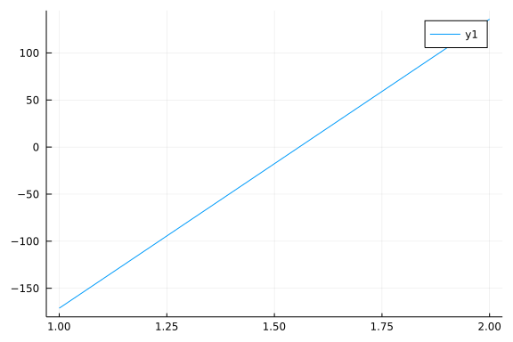

# Asset allocation

```julia
using Plots, Roots
```

```
Error: ArgumentError: Package Roots not found in current path:
- Run `import Pkg; Pkg.add("Roots")` to install the Roots package.
```


How should earnings be allocated over a lifetime to ensure a desired
consumption profile?

Assumptions:

* Constant dollars
* Borrowing and investments can be done for fixed rates
* Earnings profile
* Demand profile

Adjust the magnitude of the demand profile to have zero assets at end of life.

Demand profile. Start at 1 at age 18, increase linearly to age 30 to 2, then
jump to 3 until retirement. Then decrease linearly to 2 to age 80.

Supply profile. Start at 0 at age 18, increase linearly to age 30 to 2.0,
then jump in a couple steps, returning to 0 at age 65.

```julia
demand(age) = if age < 30
   1.0 + (age - 18.0)/30.0
   elseif age < 65
   3.0
   elseif age < 80
   3.0 - (age-65.0)/15.0
   else
   2.0
end
supply(age) = if age < 30
   0.0 + (age - 18.0)/30.0
   elseif age < 40
   2.0
   elseif age < 55
   3.0
   elseif age < 65
   3.5
   else
   0.0
end
```

```
supply (generic function with 1 method)
```


Assets start at 0 at age 18. Resources come in at rate supply per year.
Used at rate demand. Assets change at rate r (interest charges or return
on investment). Compute assets at terminal age. Scale supply by a
factor S as the parameter to be found to achieve 0 assets at the terminal
age.

```julia
function assets(S = 1.0; start = 18, stop = 85, rate = 0.03, return_sum=true)
   # assets at start of year
   a = zeros(start:stop)
   for i = start:(stop-1)
     a[i+1] = a[i]*(1+rate) + S*supply(i) - demand(i)
   end
   if return_sum
    a[stop]
   else
    a
   end
end
```

```
assets (generic function with 2 methods)
```


This is a continuous function. Negative at S = 1.0 and positive at S = 2.0.

```julia
Svec = 1.0:0.01:2.0
Avec = assets.(Svec)
Plots.plot(Svec, Avec)
```




Linear. Hmm. Wasn't expecting that.

Find root.

```julia
Starget = find_zero(assets, (1.0, 2.0), Bisection())
```

```
Error: UndefVarError: Bisection not defined
```


Plot demand, supply

```julia
ageVec = 18:1:85
Plots.plot(ageVec, demand.(ageVec))
Plots.plot!(ageVec, Starget .* supply.(ageVec))
```

```
Error: UndefVarError: Starget not defined
```


Plot assets

```julia
v = assets(Starget; return_sum=false)
Plots.plot(ageVec, collect(v))
```

```
Error: UndefVarError: Starget not defined
```


All together

```julia
Plots.plot(ageVec, demand.(ageVec))
Plots.plot!(ageVec, Starget .* supply.(ageVec))
Plots.plot!(ageVec, collect(v))
```

```
Error: UndefVarError: Starget not defined
```


